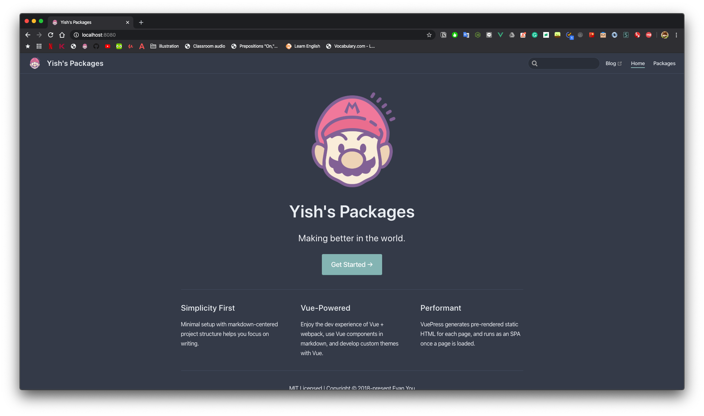
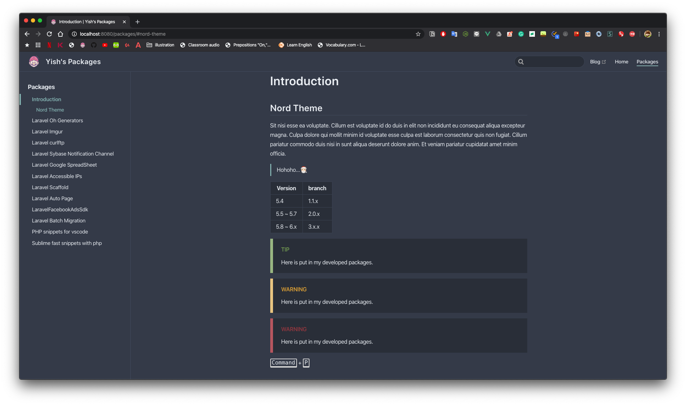

# VuePress Color Themes
It's including several I love color themes I made, it opens source now, if you have any issue or PR, welcome 😍. 
It's basic on [theme default](https://github.com/vuejs/vuepress/tree/master/packages/%40vuepress/theme-default), it's beautiful but I want to change some colors to me.

## Usage
If you like `Nord Theme`, you can navigate to `nord` directory, download `index.styl` and `palette.styl`, put it into or replace your project path:
`your-project/.vuepress/styles/`, it's done!

## Themes
### Nord Theme

